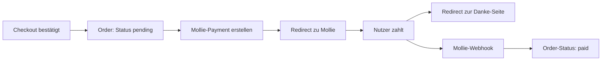

# VAINEA – Pflichtenheft für die technische Umsetzung

2026-09-19 · erstellt mit Annett & Claude

## Ausgangslage und Ziel

VAINEA existiert aktuell als interaktiver Click-Dummy, der Design, Content und Nutzerführung für einen D2C-Spa-/Resort-Lifestyle-Shop mit vier "States" (Sea, Dream, Light, Sun) validiert. Dieses Dokument beschreibt die technische Umsetzung als produktiven Online-Shop und dient als Briefing-Grundlage für die Implementierung mit Claude Code.

Ziel ist ein SEO-fähiger, serverseitig gerenderter Shop mit Gast-Checkout, Zahlungsabwicklung über Mollie und einem Admin-Bereich zur Pflege von Produkten, Bildern und Beständen – abgeleitet aus der im Click-Dummy bereits etablierten Informationsarchitektur (States, Produktkategorien, Farbvarianten).

## Technologie-Stack

| Komponente | Wahl | Begründung |
| --- | --- | --- |
| Backend-Framework | FastAPI (Python) | Async, typsicher, gute Performance, großes Ökosystem |
| Rendering | Jinja2-Templates + HTMX | Serverseitiges Rendering für SEO, HTMX für dynamische Fragmente ohne SPA-Overhead |
| Datenbank | PostgreSQL | Robust, relational, gut geeignet für Bestände/Bestellungen |
| ORM | SQLAlchemy | Standard im FastAPI-Umfeld, arbeitet mit SQLAdmin zusammen |
| Admin-Interface | SQLAdmin | Automatisch generierte CRUD-Oberfläche über die SQLAlchemy-Modelle |
| Authentifizierung | FastAPI-Users | Fertige Lösung für Account/Login, erweiterbar um Social-Login |
| Zahlungsabwicklung | Mollie | iDEAL, SEPA, Bancontact, Kreditkarte; Python-SDK, webhookbasiert |

Diese Kombination wurde auch von einem erfahrenen Entwickler aus dem Umfeld der Kundin empfohlen und deckt sich mit der Analyse zu Aufwand, SEO-Tauglichkeit und Admin-Pflegbarkeit.

## Datenmodell

Abgeleitet aus dem `PRODUCTS`- und `STATES`-Array des Click-Dummys, aber normalisiert für einen produktiven Shop:

| Entität | Wichtigste Felder | Zweck |
| --- | --- | --- |
| State | id, slug, name, hex, Mood-Text, Brand-Line, Hero-Bild, Position | Die vier Marken-States (Sea, Dream, Light, Sun) |
| Product | id, Name, Slug, Beschreibung, category, state\_id, material, price, is\_new, is\_bestseller, variant, status, product\_group\_id | Zentrale Produkttabelle, ersetzt das flache PRODUCTS-Array |
| ProductImage | product\_id, url, sort\_order, alt\_text | Mehrere Bilder pro Produkt statt einzelnem img-Feld |
| ProductSize | product\_id, size, stock, sku | Lagerbestand je Größe statt reiner Anzeigeoption |
| User | id, email, password\_hash, optionale Social-Login-Verknüpfung | Kundenkonten via FastAPI-Users |
| Cart / CartItem | session- oder user-gebunden, product\_id, size, Menge | Warenkorb, auch für Gäste per Cookie |
| Order / OrderItem | Status, Mollie-Payment-ID, Adressen, shipping\_cost, discount\_code, discount\_amount, Summen | Bestellungen inkl. fixierter Preise zum Bestellzeitpunkt |
| ShippingZone / ShippingRate | Länder, Zone, Preis je Methode, Freigrenze | Versandkosten-Logik |
| DiscountCode | Code, Typ, Wert, Gültigkeit, Nutzungslimit, Mindestbestellwert | Rabattcodes |

Die `product_group_id` verbindet Farbvarianten eines Produkts über die States hinweg – das bildet die im Click-Dummy per `productInState()` gelöste Swatch-Navigation serverseitig ab.

## Seiten- und Routenstruktur

| Route | Inhalt |
| --- | --- |
| `/` | Startseite mit States-Grid |
| `/states/{slug}` | State-Unterseite (z. B. `/states/sea`) |
| `/shop` | Produktkatalog mit Filtern per Query-Parameter |
| `/products/{slug}` | Produktdetailseite (PDP) |
| `/story` | Our-Story-Seite |
| `/cart` | Warenkorb |
| `/checkout/address`, `/checkout/payment`, `/checkout/confirm` | Mehrstufiger Checkout |
| `/account/*` | Bestellungen, Adressen, Wishlist |

Jede Seite wird beim ersten Aufruf vollständig serverseitig gerendert (für SEO und Nutzer ohne JavaScript). Interaktionen wie Filter, Farb-Swatches oder Wishlist-Toggle lösen anschließend HTMX-Requests aus, die nur das betroffene HTML-Fragment zurückliefern und per `hx-push-url` die URL aktualisieren – das bildet das heutige Click-Dummy-Verhalten nach, ohne dass der State clientseitig gehalten werden muss.

## Funktionale Anforderungen

- Produktkatalog mit Filterung nach Kategorie, State und Material
- Warenkorb mit Mengenänderung, nutzbar auch ohne Kundenkonto
- Gast-Checkout als Standardweg, optionales Kundenkonto für wiederkehrende Käufer
- Wishlist zum Merken von Produkten
- Farb-Swatch-Navigation zwischen den vier States auf der Produktdetailseite, inklusive Kennzeichnung des aktuell angezeigten States

## Versandkosten-Logik

Versandzonen (z. B. Deutschland, EU, Rest der Welt) mit je eigenem Tarif und optionaler Freigrenze ab einem bestimmten Bestellwert. Der Versandpreis wird beim Checkout anhand der Lieferadresse ermittelt und fix auf die Bestellung geschrieben, damit spätere Tarifänderungen bestehende Bestellungen nicht verändern.

Ein optionales Gewichtsfeld am Produkt wird von Anfang an mitgeführt, auch wenn die Berechnung zum Start pauschal pro Zone erfolgt – das hält die Tür für eine spätere gewichtsbasierte Versanddienstleister-Anbindung offen.

## Rabattcodes

Rabattcodes können prozentual oder als Festbetrag definiert werden, mit Gültigkeitszeitraum, optionalem Mindestbestellwert und Nutzungsbegrenzung (gesamt und/oder pro Kunde). Der Rabatt wird auf die Zwischensumme angewendet, bevor der Versand addiert wird; die Freigrenze für kostenlosen Versand bezieht sich auf den Warenwert vor Rabatt.

Angewendeter Code und Rabattbetrag werden wie der Versandpreis fix auf die Bestellung geschrieben, damit spätere Änderungen am Code alte Bestellungen nicht verfälschen.

## Zahlungsabwicklung mit Mollie

Der Bestellstatus wird erst durch den Webhook auf „paid“ gesetzt, nicht bereits durch den Redirect – nur der Webhook belegt zuverlässig, dass die Zahlung tatsächlich abgeschlossen wurde.

## Admin-Backend

SQLAdmin bildet die Pflege der zentralen Modelle ab (Product, ProductImage, ProductSize, State, Order, DiscountCode) über automatisch generierte CRUD-Oberflächen inklusive Inline-Editing für Bilder und Größen pro Produkt. Für den heutigen Umfang von rund 24 Produkten ist das ausreichend; eine tiefere Verschachtelung wie bei Django-Admin wird nicht benötigt.

Das Admin-Interface läuft zunächst unter einem geschützten Pfad und kann später auf eine eigene Subdomain (`admin.vainea.de`) umziehen, ohne dass sich am Datenmodell etwas ändert.

## Nicht-funktionale Anforderungen

**SEO**: Serverseitiges Rendering aller öffentlichen Seiten, redigierbare Meta-Title/-Description je Seite, Schema.org-Product-Markup auf den PDPs, automatisch generierte `sitemap.xml`.

**DSGVO/Datenschutz**: Cookie-Consent mit Opt-in für nicht-essenzielle Cookies (Analytics, Instagram-Embed), geprüfte Rechtstexte (Impressum, Datenschutzerklärung, AGB, Widerrufsbelehrung), Kundendaten mit Löschmöglichkeit unter Beachtung handels-/steuerrechtlicher Aufbewahrungspflichten.

**Performance**: Produktbilder in modernen Formaten (WebP/AVIF) über CDN, Lazy-Loading, HTTP-Caching für weitgehend statische Seiten wie State-Seiten und Story.

## Deployment & Hosting

Als Server Hetzner mit der FastAPI-App hinter Caddy als Reverse Proxy (automatisches TLS via Let's Encrypt), PostgreSQL als separate oder mitlaufende Instanz, Produktbilder in Objektspeicher statt lokal auf dem Server.

Der Shop bleibt auf der Root-Domain (`vainea.de`) für die SEO-Indexierung, das Admin-Interface kann auf einer separaten Subdomain mit zusätzlichem Zugriffsschutz laufen.

## Offene Punkte und nächste Schritte

- [ ] Rechtstexte (Impressum, Datenschutz, AGB, Widerrufsbelehrung) juristisch prüfen lassen
- [ ] Konkrete Versandzonen und -tarife festlegen
- [ ] Entscheidung zu Mehrsprachigkeit (aktuell nur Deutsch angenommen)
- [ ] Konkretes Verzeichnis-Grundgerüst und SQLAlchemy-Modelle als Code aufsetzen
